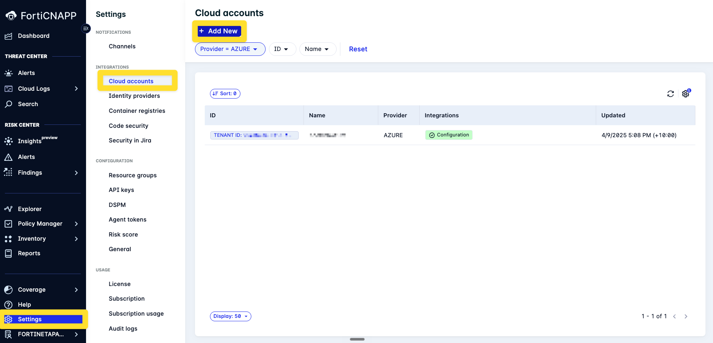
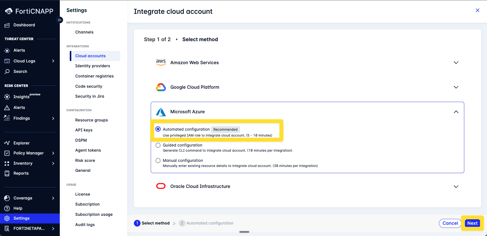
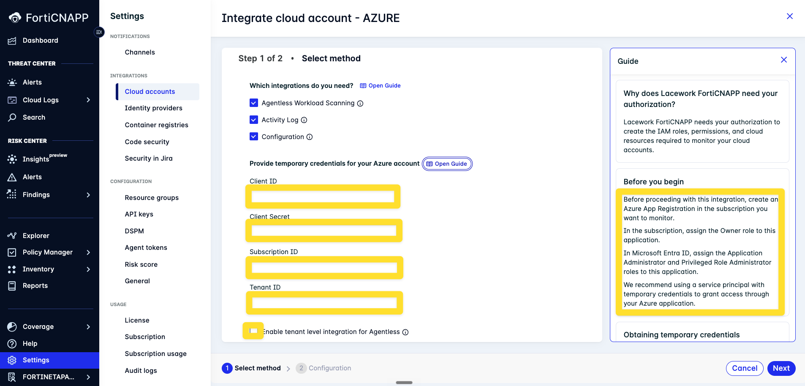
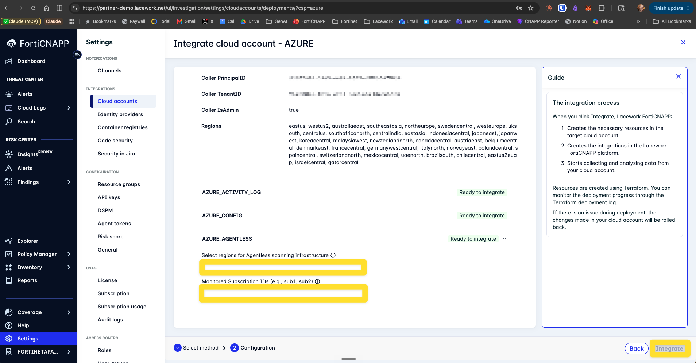

# Deployment Guide for FortiCNAPP Azure Integration

## Overview

This guide covers the end-to-end integration of an Azure environment with FortiCNAPP.

Once integrated, FortiCNAPP delivers:

- Continuous misconfiguration detection (CSPM) across all subscriptions in scope
- Identity over-privilege analysis (CIEM) for Entra ID
- Agentless VM scanning for CVEs, package inventory, and disk secrets
- Data Security Posture Management (DSPM) across Storage Accounts and blob containers
- Network exposure context via FortiGate Security Fabric integration
- Attack path analysis combining misconfiguration, identity, CVE, and network reachability
- Compliance reporting against CIS, PCI, HIPAA, NIST, ISO 27001, SOC 2, and custom frameworks
- Unified risk console consolidating findings from every source
- Outbound alert forwarding to Splunk, ServiceNow, Teams, email, and webhooks

The setup is organised into 5 steps. Most teams start with Step 1 (core integration) and add the rest as needed. Each step is independently deployable.

---

## Step 1: Core Azure Integration

The core integration is the prerequisite for everything else. It deploys an Azure AD application and grants it read access across the chosen scope, and configures Activity Log forwarding for audit-event correlation.

### Step 1.1: Decide integration level

- **Tenant-level**: monitors every subscription under a chosen Azure management group; single integration record; needs management-group-scoped permissions; auto-includes new subscriptions added under that scope. Available via Path A (Terraform).
- **Subscription-level**: monitors one specific subscription; subscription-scoped permissions; one integration record per subscription. Available via Path A (Terraform) or Path B (Console wizard).

Azure Landing Zone (ALZ) deployments typically use **tenant-level** because new subscriptions are added regularly under platform/workload management groups and tenant scope picks them up automatically.

### Step 1.2: Gather information

| Field | Where to find |
|---|---|
| Azure tenant ID | `az account show --query tenantId -o tsv` |
| Subscription IDs in scope | `az account list --query "[].{id:id, name:name}" -o table` |
| Management group ID (tenant-level only) | `az account management-group list -o table` |
| Default deployment region | Operational standard (e.g. `australiaeast`) |

#### Permission delegation model

Confirm what you can do yourself versus what needs the platform team.

**Path A (Terraform)** needs:

- Owner or User Access Administrator at the deployment scope (subscription or management group)
- Application Administrator in Entra ID
- Write access to diagnostic settings on monitored subscriptions

**Path B (Console wizard)** needs:

- Ability to create App Registrations
- Owner on the target subscription
- Application Administrator + Privileged Role Administrator on the SP in Entra ID

### Step 1.3: Choose your integration path

| Scenario | Path |
|---|---|
| Enterprise / regulated environment with IaC-mandated delivery | **Path A (Terraform)** |
| ALZ / tenant-level integration covering multiple subscriptions | **Path A (Terraform)** |
| Deployment tenant restricts Privileged Role Administrator (common in corporate) | **Path A (Terraform)**: apply-time delegation easier to arrange |
| Single-subscription deployment with full admin rights | **Path B (Console wizard)** |

Most production enterprise deployments land on Path A. Path B is documented below for completeness and single-subscription scenarios.

### Step 1.4: Path A, Terraform

Direct Terraform deployment using the `lacework/config/azure`, `lacework/activity-log/azure`, and `lacework/ad-application/azure` modules. The standard path for enterprise and regulated environments. The Path B wizard runs the same modules internally.

Use this path for:

- **Enterprise / IaC-mandated delivery**: version-controlled, code-reviewable, repeatable
- **Tenant-level Config + Activity Log**: Terraform supports management-group scope
- **Restricted deployment tenants**: apply-time RBAC delegation is easier to arrange than console-driven directory role assignment

#### Prerequisites

1. **Lacework CLI**: <a href="INSTALL-LACEWORK-CLI.md">Install and Configure Lacework CLI</a> (the Lacework Terraform provider reads `~/.lacework.toml` or `LW_*` env vars)
2. **Terraform**: <a href="INSTALL-TERRAFORM.md">Install Terraform</a>
3. **Azure CLI**: <a href="INSTALL-AZURE-CLI.md">Install and Configure Azure CLI</a>

#### Authenticate with Azure CLI

```bash
az login --tenant <tenant_id>
az account set --subscription <deployment-subscription-id>
```

#### Option 1: Apply the committed Terraform

Pick the variant matching your integration level from Step 1.1, edit the variables, and apply.

```bash
git clone https://github.com/andrewbearsley/forticnapp-azure-integration-guide.git
cd forticnapp-azure-integration-guide/terraform/<subscription-level|tenant-level>
cp terraform.tfvars.example terraform.tfvars
# edit terraform.tfvars
terraform init
terraform plan
terraform apply
```

Variant READMEs spell out the per-level apply-time IAM requirements: <a href="terraform/subscription-level/README.md">subscription-level</a> · <a href="terraform/tenant-level/README.md">tenant-level</a>.

#### Option 2: Generate fresh with `lacework generate`

Use this when you need a non-standard combination (existing AD application, specific Event Hub location, custom storage account naming).

```bash
# Subscription-level
lacework generate cloud-account azure \
  --noninteractive \
  --configuration \
  --activity_log \
  --subscription_id <deployment-subscription-id>

# Tenant-level (via Azure management group)
lacework generate cloud-account azure \
  --noninteractive \
  --configuration \
  --activity_log \
  --management_group \
  --management_group_id <management-group-id> \
  --all_subscriptions \
  --subscription_id <deployment-subscription-id>
```

Terraform files land in `~/lacework/azure` by default (override with `--output`).

Flags:

- `--configuration`: provision Azure Config (CSPM) integration
- `--activity_log`: provision Azure Activity Log integration
- `--subscription_id`: subscription where Lacework deployment resources are created (Storage Account + Event Hub for Activity Log, AD application owner)
- `--management_group` + `--management_group_id`: scope Config to a management group (tenant-level)
- `--all_subscriptions`: also enable Activity Log forwarding from every subscription under the management group

Drop `--noninteractive` to walk through prompts instead. Then:

```bash
cd ~/lacework/azure
terraform init
terraform plan
terraform apply
```

Reference: <a href="https://docs.fortinet.com/document/forticnapp/latest/cli-reference/635459/lacework-generate-cloud-account-azure" target="_blank">lacework generate cloud-account azure</a>

### Step 1.5: Path B, Console wizard

The wizard runs Terraform under the hood (the same modules used in Path A). It bundles app registration, role assignment, Storage Account + Event Hub creation, Activity Log diagnostic setting, and the FortiCNAPP integration into a two-step UI.

The wizard offers three methods, surfaced on Step 1:

| Method | What it does | Time |
|---|---|---|
| **Automated** (recommended) | Runs Terraform via a privileged SP you pre-create. Console executes the apply. | 5-10 min |
| **Guided** | Generates a `lacework generate` CLI command you copy and run locally. | 10 min |
| **Manual** | For environments with pre-existing AD app + resources you want to point the integration at. | 30 min |

The rest of this section covers the Automated method. For Guided, the generated command is the same shape as Path A Option 2 above. For Manual, follow the in-wizard prompts.

#### Prerequisites for the Automated method

1. <a href="INSTALL-AZURE-CLI.md">Azure CLI</a> logged in via `az login`
2. An Azure App Registration (service principal) with:
   - **Owner** role on the target subscription
   - **Application Administrator** + **Privileged Role Administrator** in Entra ID (on the deployment tenant), assigned to the SP

Create the SP with one command:

```bash
az ad sp create-for-rbac \
  --name "fcnapp-wizard" \
  --role Owner \
  --scopes /subscriptions/<SUB_ID>
```

Capture `appId`, `password`, and `tenant` from the JSON output. These become the wizard's Client ID, Client Secret, and Tenant ID.

Tighten the credential lifetime to a few hours (the wizard only needs them for the duration of the integration run):

```bash
# Linux / WSL (GNU date)
az ad sp credential reset --id <APP_ID> \
  --end-date "$(date -d '+6 hour' -u +'%Y-%m-%dT%H:%M:%SZ')"

# macOS (BSD date)
az ad sp credential reset --id <APP_ID> \
  --end-date "$(date -v +6H -u +'%Y-%m-%dT%H:%M:%SZ')"
```

Then assign the two Entra directory roles to the SP. Portal is fastest: **Microsoft Entra ID → Roles and administrators →** search **Application Administrator →** Add assignments → search for the SP. Repeat for **Privileged Role Administrator**.

**Gotcha:** corporate tenants commonly block this step. Assigning directory roles requires you to hold **Privileged Role Administrator** or **Global Administrator** yourself in the deployment tenant. In production corporate environments this is usually restricted to a small IT admin team. If `Add assignments` is greyed out, you have three choices:

- Ask IT to grant the SP those directory roles on your behalf
- Ask IT for a short-term Privileged Role Administrator assignment for yourself (via PIM if the tenant uses it)
- Switch to **Path A (Terraform)**: the apply needs the same permissions, but apply-time delegation is usually easier to arrange than console-driven role assignment

#### Wizard flow

1. Log in to your FortiCNAPP account using one of these methods:
   - **Via FortiCloud**: Services → Show More → Lacework FortiCNAPP
   - **Direct login**: `https://<account>.lacework.net`
2. **Settings → Integrations → Cloud Accounts → + Add New**

   

3. Choose **Microsoft Azure**, select **Automated configuration**, click **Next**

   

4. On Step 1 of 2:
   - Tick the integrations you need: **Agentless Workload Scanning**, **Activity Log**, **Configuration** (any combination)
   - Paste the four SP values: Client ID, Client Secret, Subscription ID, Tenant ID
   - Optionally tick **Enable tenant level integration for Agentless** if you want Agentless to cover multiple subscriptions
   - **Next**

   

5. On Step 2 of 2 (Discovery Summary): the wizard authenticates as the SP and shows Caller object/principal/tenant IDs, IsAdmin status, and the list of regions it can see. Each enabled integration shows **Ready to integrate**.
6. Configure each integration:
   - **Activity Log** and **Configuration** scope automatically to the SP's subscription. No input required
   - **Agentless**: select the Azure regions for the scanning infrastructure, and list the Monitored Subscription IDs (comma-separated)

   

7. Click **Integrate**. The wizard runs Terraform; failures roll back automatically.
8. Wait for the initial sync (typically 15-60 minutes for first-time Config evaluation).

#### Wizard scope limits

- **Activity Log and Configuration are scoped to the SP's single subscription.** There is no management-group (tenant-level) option for these integrations in the Automated wizard. For tenant-level Config + Activity Log, use **Path A** with the `--management_group` flag.
- Agentless can span multiple subscriptions via the Step 1 toggle and the Monitored Subscription IDs field on Step 2.

Reference: <a href="https://docs.fortinet.com/document/forticnapp/latest/administration-guide/729300/integrating-your-azure-environment" target="_blank">Integrating your Azure environment</a>

### Step 1.6: Verify

In the FortiCNAPP console, navigate to **Settings → Integrations → Cloud Accounts**. The Azure integration status displays as **Success** when Config has enumerated subscriptions and Activity Log is receiving events. Allow 1-2 hours for the first compliance evaluation to populate.

Reference: <a href="https://registry.terraform.io/modules/lacework/config/azure/latest" target="_blank">lacework/config/azure</a> · <a href="https://registry.terraform.io/modules/lacework/activity-log/azure/latest" target="_blank">lacework/activity-log/azure</a>

---

## Step 2: Agentless Workload Scanning

Agentless workload scanning provides VM-level CVE detection without installing agents. It scans both running and stopped VMs by snapshotting and analysing disk contents in a customer-controlled scanning subscription.

Common to both paths:

- Deploys per-region. Each Azure region where you have VMs needs its own regional module
- Uses an hourly scheduled Container App Job as orchestrator; spins up ephemeral scanning VMs per scan cycle
- Requires a dedicated **scanning subscription** with compute and storage capacity
- Default deployment uses a NAT Gateway + Public IP for outbound traffic. In environments with Azure Policy DENY on public IP creation, request an exemption scoped to the scanning subscription only (the public IP is on the egress NAT, not on scanning VMs)
- Secrets-on-disk detection is part of the same scanning job

### Step 2: Path A, Terraform

Full IaC control via the dedicated agentless deployment guide, which covers custom VNet/subnet, existing NAT reuse, Azure Policy DENY exemptions, and multi-region rollout patterns:

<a href="https://github.com/andrewbearsley/forticnapp-azure-agentless-workload-scanning-guide" target="_blank">forticnapp-azure-agentless-workload-scanning-guide</a>

Reference: <a href="https://registry.terraform.io/modules/lacework/agentless-scanning/azure/latest" target="_blank">lacework/agentless-scanning/azure</a>

### Step 2: Path B, Console wizard

Tick **Agentless Workload Scanning** in the Step 1 wizard and provide regions + monitored subscription IDs on Step 2 of the wizard. The wizard deploys a default agentless setup using FortiCNAPP-managed defaults for VNet, NAT, and scheduling. Good for single-subscription and standard environments.

---

## Step 3: Data Security Posture Management (DSPM)

DSPM discovers and classifies sensitive data across Azure Storage Accounts and blob containers. Findings are joined to the broader risk view so a misconfigured storage account containing PII is prioritised above one containing logs.

### Setup

DSPM is enabled per Azure cloud-account integration once Step 1 is in place.

1. In the FortiCNAPP console, navigate to **Settings → Integrations → Cloud Accounts**
2. Open the Azure integration created in Step 1
3. Enable **DSPM** on the integration
4. The integration's service principal needs additional read access to Storage Account data planes. The wizard provisions this; for Terraform-deployed integrations, re-apply with the DSPM flag enabled

DSPM scans run on a configurable schedule. First-pass classification typically completes within 24 hours of enablement for typical-sized environments.

Reference: <a href="https://docs.fortinet.com/document/forticnapp/latest/administration-guide" target="_blank">FortiCNAPP Administration Guide: DSPM</a>

---

## Step 4: FortiGate Security Fabric Integration

FortiGate integration enriches workload risk scoring with network exposure context. A workload that's reachable from the internet through the FortiGate gets a higher score than one behind allow-list-only rules, even if both have the same CVE.

### Setup

This is a two-sided configuration:

#### FortiGate side

- Confirm FortiGate firmware version meets the minimum for FortiCNAPP integration
- Enable Fabric Connector or API access for FortiCNAPP to query FortiGate state
- The integration can run direct (FortiCNAPP ↔ FortiGate) or via FortiAnalyzer / FortiManager as intermediary, depending on the deployment

#### FortiCNAPP side

1. Navigate to **Settings → Integrations**
2. Add a **FortiGate** integration
3. Provide FortiGate management URL and authentication credentials
4. Confirm reachability (FortiCNAPP needs outbound access to the FortiGate management interface)

Once both sides are connected, FortiCNAPP automatically incorporates FortiGate findings into the unified risk score. No per-workload action is needed.

Reference: <a href="https://docs.fortinet.com/document/forticnapp/latest/administration-guide" target="_blank">FortiCNAPP Administration Guide: Fortinet integrations</a>

---

## Step 5: Alert Channels

Alert channels forward FortiCNAPP-generated alerts to downstream tools (Splunk, ServiceNow, Microsoft Teams, email, generic webhooks). Common pattern for SIEM forwarding: route to Splunk via an Azure Event Hub.

### Setup

1. Navigate to **Settings → Notifications → Alert Channels**
2. Click **Add New** and choose the target channel type
3. Provide endpoint details (Splunk HEC URL + token, Event Hub connection string, webhook URL, etc.)
4. Test the channel
5. Navigate to **Settings → Notifications → Alert Rules** and bind the channel to alert rules, typically by severity threshold, integration source, or resource group

Splunk via Event Hub example:

- Create the Event Hub namespace in your customer-owned Azure subscription
- Create a shared access policy with `Send` permission
- In FortiCNAPP, configure an **Azure Event Hub** alert channel using the namespace + entity path + connection string
- Splunk's Azure Event Hubs input pulls from the same Event Hub

Reference: <a href="https://docs.fortinet.com/document/forticnapp/latest/administration-guide" target="_blank">FortiCNAPP Administration Guide: Alert Channels</a>

---

## Capability Coverage Matrix

| Capability | Source phase | Notes |
|---|---|---|
| CSPM (continuous misconfig detection) | Step 1 (Config) | All subscriptions under the integration scope |
| CIEM (identity over-privilege) | Step 1 (Config) | Cloud-only Entra ID supported, PIM-gated roles respected |
| Attack Path Analysis | Step 1 (Config) + Step 2 (Agentless) | Multi-hop combining misconfig + identity + CVE + network |
| Compliance reporting | Step 1 (Config) | CIS, PCI, HIPAA, NIST, ISO 27001, SOC 2 out of the box. Custom frameworks supported. |
| VM CVE scanning | Step 2 (Agentless) | Includes stopped/offline VMs via disk snapshot |
| Secrets detection (disk) | Step 2 (Agentless) | Part of the agentless scanning job |
| Secrets detection (blob storage) | Step 3 (DSPM) | Enabled per Azure integration |
| DSPM | Step 3 (DSPM) | Storage Accounts + blob containers |
| FortiGate exposure context | Step 4 (FortiGate) | Network reachability enriches risk scores |
| Unified risk console | All steps | Single portal consolidates findings from every source |
| SIEM forwarding | Step 5 (Alert channels) | Splunk, ServiceNow, Teams, email, webhooks |

---

## IAM Permissions Summary

### Deployment-time permissions

Provisioning the integration requires permissions to create Azure AD applications and role assignments, plus Storage Account / Event Hub for Activity Log sinks. Specifics vary by path.

**Path A (Terraform)**: the principal running `terraform apply` needs:

- **Owner** or **User Access Administrator** at the deployment scope (subscription for subscription-level, management group for tenant-level)
- **Application Administrator** in Entra ID (to create the AD application)
- Permission to write diagnostic settings on every monitored subscription (Contributor or a custom role with `Microsoft.Insights/diagnosticSettings/write`)

Running Terraform as a service principal instead of a user: the same RBAC at the deployment scope, plus `Microsoft.Graph/Application.ReadWrite.OwnedBy` API permission in Entra ID instead of Application Administrator.

**Path B (Console wizard, Automated method)**: the wizard SP needs:

- **Owner** on the target subscription (for resource creation + role assignment)
- **Application Administrator** + **Privileged Role Administrator** in Entra ID, assigned to the SP itself

The human assigning those directory roles to the SP must hold **Privileged Role Administrator** or **Global Administrator** in the deployment tenant. In corporate environments this is typically restricted to a small IT admin team. Coordinate ahead of time or use Path A.

For agentless workload scanning specifically, see the sibling guide's <a href="https://github.com/andrewbearsley/forticnapp-azure-agentless-workload-scanning-guide#iam-permissions" target="_blank">IAM Permissions section</a>.

### Runtime permissions

The created Azure AD application is granted:

- **Reader** at the tenant management group (tenant-level) or subscription (subscription-level), for Config reads
- **Reader** on the Activity Log sink resource, for event pulls
- Additional data-plane reads on Storage Accounts if DSPM is enabled
- No write permissions on monitored resources

For Azure Policy DENY environments (common in ALZ deployments, e.g. DENY on public IP creation), the only resource type that typically needs an exemption is the **NAT Gateway public IP** in the agentless scanning subscription. The exemption can be scoped to the scanning subscription only. All other steps operate within standard Reader permissions and do not create public-facing resources.

---

## How It Works

### Step 1 (Config): Process

1. An Azure AD application (service principal) is created with read-only permissions across monitored subscriptions
2. FortiCNAPP polls Azure ARM APIs continuously to enumerate resources and configurations
3. Resource state is evaluated against active compliance frameworks
4. Misconfigurations surface as policy violations under **Compliance → Resources** and **Reports**

### Step 1 (Activity Log): Process

1. A diagnostic setting is created on each monitored subscription, exporting Activity Log events to a customer-side Event Hub or Storage Account
2. FortiCNAPP pulls events at regular intervals
3. Events are normalised and used to build the **Polygraph** behavioural baseline, joined with Config posture data
4. Anomalous activity, known malicious threats, and resource-change events surface under **Events → Cloud Activity** and feed composite alerts

### Step 2 (Agentless): Process

See <a href="https://github.com/andrewbearsley/forticnapp-azure-agentless-workload-scanning-guide#how-it-works" target="_blank">sibling guide</a> for the full scanning lifecycle.

### Attack Path Analysis: Process

Once Step 1 + Step 2 data is present, FortiCNAPP automatically constructs attack-path graphs. No additional configuration is needed. Paths surface under **Attack Path Analysis** in the console and are factored into prioritised risk lists.

---

## Resources

- <a href="https://docs.fortinet.com/document/forticnapp/latest/administration-guide/729300/integrating-your-azure-environment" target="_blank">FortiCNAPP: Integrating your Azure environment</a>
- <a href="https://docs.fortinet.com/document/forticnapp/latest/administration-guide/991151/preparing-for-integration" target="_blank">FortiCNAPP: Preparing for integration</a>
- <a href="https://registry.terraform.io/modules/lacework/ad-application/azure/latest" target="_blank">Terraform Registry: lacework/ad-application/azure</a>
- <a href="https://registry.terraform.io/modules/lacework/config/azure/latest" target="_blank">Terraform Registry: lacework/config/azure</a>
- <a href="https://registry.terraform.io/modules/lacework/activity-log/azure/latest" target="_blank">Terraform Registry: lacework/activity-log/azure</a>
- <a href="https://registry.terraform.io/modules/lacework/agentless-scanning/azure/latest" target="_blank">Terraform Registry: lacework/agentless-scanning/azure</a>
- <a href="https://github.com/andrewbearsley/forticnapp-azure-agentless-workload-scanning-guide" target="_blank">Sibling guide: Azure Agentless Workload Scanning</a>
